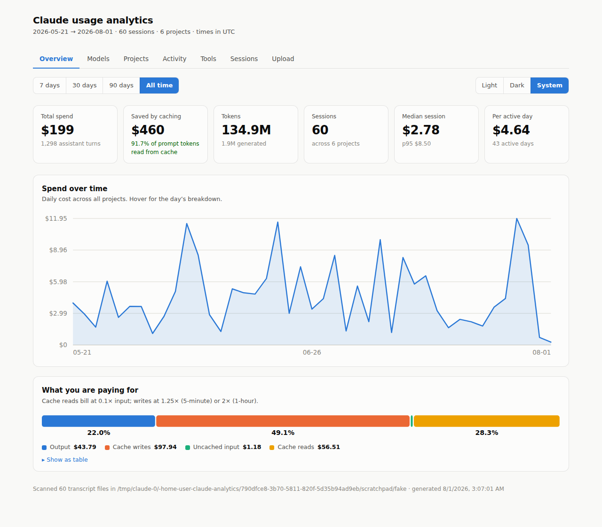
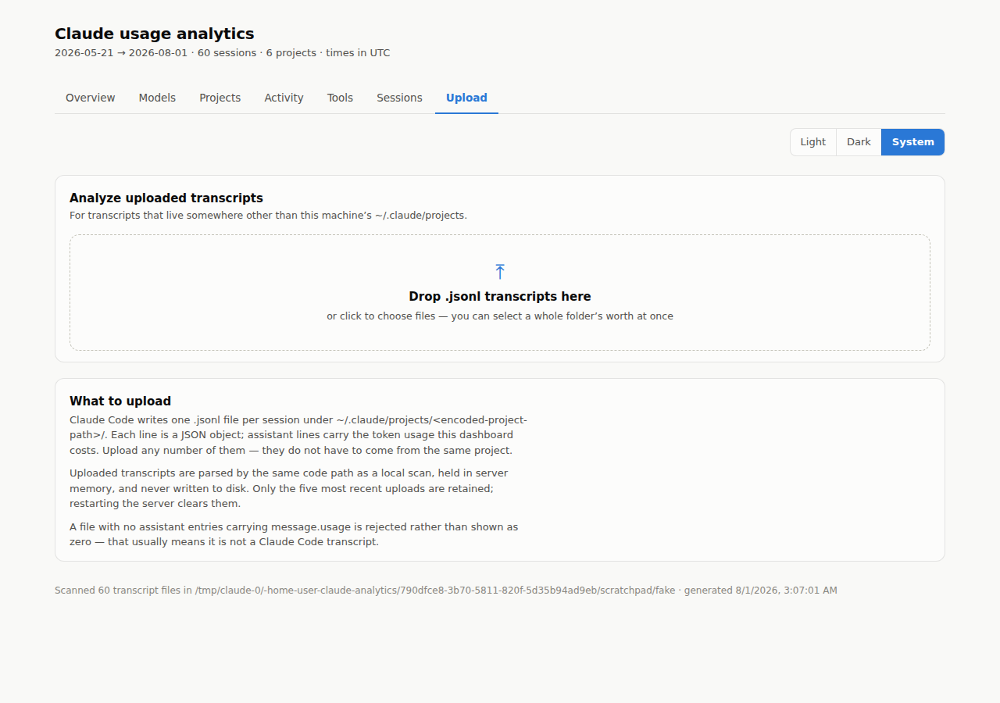

# claude-analytics

A deep analytics dashboard for your Claude Code usage, built entirely from the
session transcripts already on your machine. No API key, no telemetry, no
network calls — it reads `~/.claude/projects`, costs every request against the
published model rates, and serves a local dashboard.



The dashboard is split across pages — **Overview**, **Models**, **Projects**,
**Activity**, **Tools**, **Sessions**, and **Upload** — navigated by hash route
(`#/models`), so links are shareable and there is still no build step.

## Quick start

```bash
node bin/claude-analytics.js
# → http://127.0.0.1:4785
```

Requires Node 18+. There are no dependencies to install.

```bash
node bin/claude-analytics.js --summary       # terminal summary, no server
node bin/claude-analytics.js --json          # full report as JSON
node bin/claude-analytics.js --since 2026-07-01
node bin/claude-analytics.js --port 8080
node bin/claude-analytics.js --dir /path/to/.claude/projects
node bin/claude-analytics.js --tz America/New_York
```

## The pages

| Page | What it answers |
|---|---|
| **Overview** | Headline tiles (spend, cache savings, tokens, median/p95 session cost), daily spend over time, and the split across output / cache writes / uncached input / cache reads — usually the most surprising chart |
| **Models** | Spend per model, reasoning effort, how turns ended (a high `max_tokens` share means truncation), and CLI versions |
| **Projects** | Spend per project and per git branch |
| **Activity** | Weekday × hour heatmap, spend by hour of day, and a day-by-day table |
| **Tools** | Every tool call, with MCP tools distinguished from built-ins |
| **Sessions** | Every session, most expensive first, with duration, `$/hr`, and a filter box |
| **Upload** | Analyze transcripts from somewhere other than this machine |

The time-range filter (7 / 30 / 90 days / all) applies across every page.

## Analyzing uploaded transcripts



The **Upload** page takes `.jsonl` transcripts that aren't in this machine's
`~/.claude/projects` — a teammate's export, an archived run, a copy pulled off a
build server. Drop them in and the whole dashboard switches to that dataset; a
chip in the toolbar shows which data you're looking at, and dismissing it
returns to local transcripts.

Uploads are parsed by the **same server-side parser** as a local scan rather
than a second implementation in the browser, so the dedup and costing rules
can't drift between the two paths. The dataset is held in server memory only,
never written to disk; the five most recent are retained and a restart clears
them. A file with no assistant entries carrying `message.usage` is rejected
outright rather than displayed as zero, since that almost always means it isn't
a Claude Code transcript.

## How costs are computed

Each assistant turn carries a `usage` object. Tokens are billed at the
first-party API rates in `src/pricing.js`:

- **input** and **output** at the model's published per-million rates
- **cache reads** at `0.1×` the input rate
- **cache writes** at `1.25×` (5-minute TTL) or `2×` (1-hour TTL) — the two are
  costed separately when the transcript reports the breakdown
- **fast mode** (`speed: "fast"`) at its own premium rate

"Saved by caching" is a net figure: what the cache-read tokens would have cost
at full input price, minus what they actually cost, minus the premium already
paid on cache writes. It is not gross savings.

Two things worth knowing about the numbers:

- Rates are **first-party Claude API**. Transcripts from Amazon Bedrock or
  Vertex AI are recognized and normalized, but costed at first-party rates —
  those platforms are partner-operated and priced separately. Edit
  `src/pricing.js` if you need their rates.
- Model IDs are normalized before lookup, so `anthropic.claude-sonnet-4-6`,
  `claude-haiku-4-5-20251001`, and `claude-haiku-4-5` all resolve correctly.
  An unrecognized model is costed at zero rather than guessed at, so a sudden
  drop in reported spend usually means a new model needs a table entry.

## Transcript quirks it handles

These are the things that make a naive parser wrong:

- **One request writes several lines.** A single API request is written as one
  line per content block — thinking, text, and tool_use each get their own —
  all carrying the same `requestId` and an *identical* `usage` object. Counting
  each line double-bills the session; deduplicating by `requestId` and keeping
  only the first line silently drops most tool calls. The parser bills once per
  request and merges content across all of its lines.
- **Tool results are not prompts.** `type: "user"` entries include tool results
  and meta entries; only genuine human turns are counted as user messages.
- **Directory names are lossy.** `~/.claude/projects/-home-user-foo` can't be
  reliably decoded back to a path, so the `cwd` field on the entries themselves
  is preferred.
- Malformed lines are counted, not fatal — a partially-written transcript from
  a live session still parses.

## JSON API

The server exposes the full report if you'd rather build on it:

| Endpoint | Returns |
|---|---|
| `GET /api/report?since=&tz=&source=` | The complete report object; `source` selects an uploaded dataset |
| `POST /api/analyze` | `{files:[{name,text}]}` → `{id, turns, sessions, …}`; pass `id` as `source` above |
| `GET /api/session?id=` | One session's rollup |
| `GET /api/models` | The pricing table |

The report includes several breakdowns the dashboard doesn't render —
`byBranch`, `byVersion`, `byStopReason`, and `hourly`.

## Layout

```
bin/claude-analytics.js   CLI entry point (serve / --summary / --json)
src/pricing.js            model table, ID normalization, per-request costing
src/parser.js             transcript discovery, flattening, upload parsing
src/analytics.js          pure aggregations over flattened turns
src/server.js             static files, JSON API, upload analysis
public/charts.js          formatters, SVG marks, tooltip — no data or routing
public/pages.js           one render function per page
public/upload.js          the upload page
public/app.js             hash router, data loading, controls
```

## Privacy

The server binds to `127.0.0.1` by default and the report includes project
paths and the opening line of prompts. Use `--host` to change the bind address
only if you understand that.
